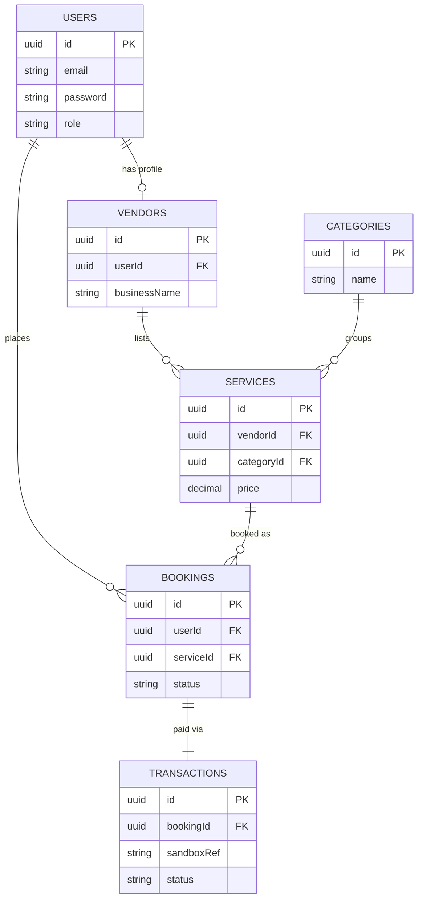

# Service Marketplace (Multi-Vendor Booking Platform)

A full-stack, multi-tenant service marketplace — Admin / Vendor / End-User roles —
built for Assessment 4 (Vibe Coding Challenge), inspired by systems like Sheba.xyz.

**Live demo:**
- Frontend: https://assessment-4-service-marketplace.vercel.app
- Backend API: https://assessment-4-service-marketplace-api.onrender.com

> ⚠️ The backend is hosted on Render's free tier, which spins down after ~15 minutes
> of inactivity. The **first** request after idle time can take 30-50 seconds to
> respond while the server wakes up. This is expected — just wait it out.

---

## Tech stack

| Layer | Technology |
|---|---|
| Frontend | React + Vite + Tailwind CSS, deployed on Vercel |
| Backend | Node.js + Express, deployed on Render |
| Database | PostgreSQL (Supabase), accessed via Prisma ORM v5 |
| Auth | JWT + bcrypt, custom role-based middleware (no third-party auth provider) |
| Payments | Self-built sandbox payment simulator (no real money, no third-party gateway keys required) |

---

## Project structure

```
service-marketplace/
├── backend/          # Express API
│   ├── prisma/        # schema.prisma, migrations, seed.js
│   └── src/
│       ├── controllers/
│       ├── middleware/
│       ├── routes/
│       └── utils/
└── frontend/          # React app
    └── src/
        ├── api/
        ├── components/
        ├── context/
        └── pages/
```

---

## Roles & what each can do

| Role | Capabilities |
|---|---|
| **Admin** | View platform-wide stats, view all registered users |
| **Vendor** | List/edit/delete services, set pricing, view & manage received bookings |
| **End-user** | Browse/search marketplace catalog, book a service, pay via sandbox checkout, view order history |

---

## Database schema (ERD)



**Design notes:**
- `Booking` and `Transaction` are kept as separate models. A `Booking` represents the
  user's intent to purchase a service (created in `PENDING` state). A `Transaction`
  is the record of an actual sandbox payment *attempt* against that booking — this
  separation mirrors how real payment gateway integrations work (a booking can exist
  without ever being paid, and a transaction always belongs to exactly one booking).
- `Service.price` is copied into `Booking.amount` at booking time, so historical
  orders aren't affected if a vendor changes their price later.

---

## Local setup

### Prerequisites
- Node.js 22 LTS (avoid odd-numbered "Current" releases like Node 25 — see the
  Vibe Coding Workflow doc for why this matters)
- A free Supabase account (Postgres database)
- npm

### 1. Clone the repo
```bash
git clone https://github.com/tajwarchy/assessment-4-service-marketplace.git
cd assessment-4-service-marketplace
```

### 2. Backend setup
```bash
cd backend
npm install
cp .env.example .env
```
Edit `.env` and fill in:
- `DATABASE_URL` — your Supabase **Transaction pooler** connection string (port 6543)
- `DIRECT_URL` — your Supabase **Session pooler** connection string (port 5432)
- `JWT_SECRET` — any random string (generate with `node -e "console.log(require('crypto').randomBytes(32).toString('hex'))"`)
- `PORT` — `5001` (or any free port — macOS reserves port 5000 for AirPlay Receiver)

Run migrations and seed data:
```bash
npx prisma migrate dev --name init
npx prisma db seed
```

Start the server:
```bash
npm run dev
```
API now running at `http://localhost:5001`.

### 3. Frontend setup
```bash
cd ../frontend
npm install
cp .env.example .env
```
Edit `.env`:
```
VITE_API_URL=http://localhost:5001/api
```

Start the dev server:
```bash
npm run dev
```
Visit the printed local URL (usually `http://localhost:5173`).

---

## Seeded test accounts

All seeded accounts share the password: **`Password123!`**

| Role | Email |
|---|---|
| Admin | `admin@marketplace.com` |
| Vendor | `vendor1@marketplace.com` |
| Vendor | `vendor2@marketplace.com` |
| End-user | `user1@marketplace.com` |
| End-user | `user2@marketplace.com` |

---

## Sandbox payment behavior

The checkout flow uses a self-built sandbox payment simulator (no real card data,
no third-party API keys required):

- Any card number → simulates a **successful** payment (`PAID`)
- Any card number **ending in `0000`** → simulates a **declined** payment (`FAILED`)

This lets a reviewer demonstrate both the happy path and the failure path without
needing real payment credentials.

---

## API overview

| Method | Endpoint | Access |
|---|---|---|
| POST | `/api/auth/register` | Public |
| POST | `/api/auth/login` | Public |
| GET | `/api/auth/me` | Authenticated |
| GET | `/api/categories` | Public |
| POST | `/api/categories` | Admin |
| GET | `/api/services` | Public (supports `?search=&categoryId=&minPrice=&maxPrice=`) |
| GET | `/api/services/:id` | Public |
| GET | `/api/services/mine` | Vendor |
| POST/PUT/DELETE | `/api/services/:id` | Vendor (own services only) |
| POST | `/api/bookings` | End-user |
| POST | `/api/bookings/:id/pay` | End-user (sandbox payment) |
| GET | `/api/bookings/mine` | End-user |
| GET | `/api/bookings/vendor` | Vendor |
| PATCH | `/api/bookings/:id/complete` | Vendor |
| GET | `/api/admin/users` | Admin |
| GET | `/api/admin/stats` | Admin |

---

## Further documentation

- [Vibe coding workflow & AI-assistance reflection](./docs/VIBE_CODING_WORKFLOW.md)
- [State management & route protection notes](./docs/ARCHITECTURE_NOTES.md)
- Demo video: *(add your recorded link here before submission)*